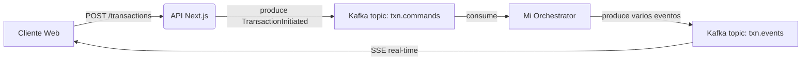

# 🏦 Sistema de Eventos Bancarios (Kafka + Next.js)

Trabajo Práctico Final – Programación Avanzada

**Autor:** Luca Saboredo – UADER – 2025

---

## 📌 Introducción

¡Hola! Soy **Luca Saboredo** y este es mi proyecto final para la materia **Programación Avanzada** (Licenciatura en Sistemas, UADER). 

Para este TP, decidí construir un **sistema de transacciones bancarias en tiempo real**, basándome en una **arquitectura orientada a eventos (Event-Driven Architecture)** utilizando **Apache Kafka**.

El flujo que implementé funciona así:
1. Cuando un usuario inicia una transacción desde mi aplicación web, el backend publica inmediatamente un evento en Kafka.
2. Desarrollé un **Orchestrator** (consumidor de Kafka) que se encarga de procesar ese evento. Este evalúa la lógica de negocio (como reservar fondos, detectar un posible fraude, y confirmar o revertir la operación), y luego genera y produce nuevos eventos.
3. Estos últimos eventos son transmitidos en vivo al cliente a través de **Server-Sent Events (SSE)**.

✅ El resultado es que logré que cualquier persona pueda ver, paso a paso, cómo evoluciona una transacción bancaria en tiempo real desde el navegador.

## 🎯 Mis Objetivos con este Proyecto

✔ **Aplicar arquitectura de eventos** en un entorno realista.
✔ Manejar **procesamiento distribuido** y encolado de mensajes usando Kafka.
✔ Implementar **comunicación asíncrona** entre microservicios/módulos.
✔ Lograr **streaming real-time** hacia el navegador sin usar WebSockets, optando por SSE.
✔ Construir un **orquestador** que determine el flujo de casos de negocio bancarios.

## 🧩 Tecnologías que elegí utilizar

| Componente | Tecnología que implementé |
| --- | --- |
| **Frontend** | Next.js 16 + React + TailwindCSS |
| **Mensajería / Streaming** | Apache Kafka (corriendo en modo standalone en Docker) |
| **Backend Orquestación** | Node.js + KafkaJS |
| **Protocolos** | REST híbrido + SSE (Server-Sent Events) |
| **Infraestructura local** | Docker Compose |

## 🔄 Flujo de Eventos (La Arquitectura que diseñé)



## 🧪 Lógica de negocio simulada

Para que el proyecto se pueda probar fácilmente, programé el Orchestrator de forma que decida si la operación es aprobada o rechazada en base a una probabilidad de fraude ficticia:

| Riesgo de Fraude | Resultado |
| :--- | :--- |
| **Bajo** | Transacción Aprobada (`Committed`) |
| **Alto** | Transacción Rechazada (`Reversed`) |

Es una simulación totalmente controlada para fines demostrativos.

## 🚀 Cómo ejecutar mi proyecto

Si querés probar mi proyecto en tu entorno local, estos son los pasos a seguir:

**1️⃣ Instalar las dependencias**

```bash
npm install
```

**2️⃣ Levantar Kafka con Docker**

Yo armé un archivo `docker-compose.yml` en la carpeta `docker`. Para iniciarlo, corré:

```bash
docker compose -f docker/docker-compose.yml up -d
```

Para asegurarte de que levantó bien mi contenedor de Kafka:
```bash
docker ps
```
*(Deberías ver un contenedor llamado `kafka` en ejecución).*

**3️⃣ Inicializar Tópicos**

Si querés asegurarte de que los topics de Kafka existen, ejecutá:
```bash
npm run topics:init
```

**4️⃣ Ejecutar el Orchestrator (Mi consumidor/productor de Kafka)**

En una terminal, iniciá el proceso de background:
```bash
npm run orchestrator
```

Si todo conecta bien con Kafka, vas a ver logs similares a estos:
```text
Orchestrator ready. Waiting for commands…
[RECV] TransactionInitiated txn=...
[EMIT] FundsReserved …
[EMIT] FraudChecked …
```

**5️⃣ Ejecutar la aplicación web**

En otra terminal, levantá un servidor de Next.js:
```bash
npm run dev
```

Por último, abrí tu navegador en: 👉 **http://localhost:3000/**

**Para probar el sistema:**
✅ Completá el formulario de la izquierda.
✅ Hacé click en **"Iniciar transacción"**.
✅ ¡Observá cómo el Timeline de la derecha recibe mis eventos de Kafka y se actualiza en tiempo real! 🎯

*Nota para revisión:*
📌 *Colocar 2 o 3 capturas de mi proyecto funcionando.*

## ✅ Conclusiones

A lo largo del desarrollo de este TP, logré:
✔ Implementar con éxito una arquitectura distribuida real.
✔ Dominar la comunicación asíncrona event-driven mediante Apache Kafka.
✔ Resolver el requerimiento de streaming de actualizaciones en vivo al cliente empleando SSE (evitando la sobrecarga de WebSockets).
✔ Desarrollar una interfaz de usuario limpia y responsiva que hace muy intuitivo monitorear un proceso bancario en tiempo de ejecución.
✔ Manejar flujos de compensación (Aprobación/Reversión automática) en base al análisis de riesgo ficticio.

---

### **Autor**
**Luca Saboredo**
Licenciatura en Sistemas – UADER
2025
